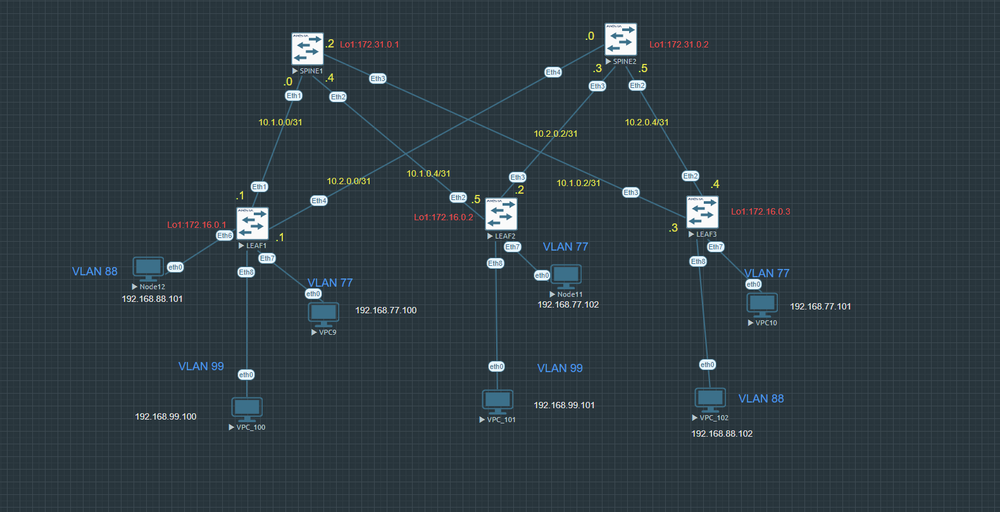

Проектная работа по теме "Переход сети ДЦ со статического VXLAN на EVPN"

Цель:

 - Настроить стаический L2\L3 VXLAN на коммутаторах, проверить их связность.
 - Перенастроить на EVPN+L2/L3 VNI и проверить их связность.

Описание:
Оборудование для лаборатории - Arista SW (4.29.2F) Для underlay будет использован eBGP.

Сети для loopback'ов:
SPINE1 - 172.31.0.1
SPINE2 - 172.31.0.2

LEAF1 - 172.16.0.1
LEAF2 - 172.16.0.2
LEAF3 - 172.16.0.3

Сети для связи коммутаторов указаны на схеме, т.к., и они почти не упоминаются.

Схема:

