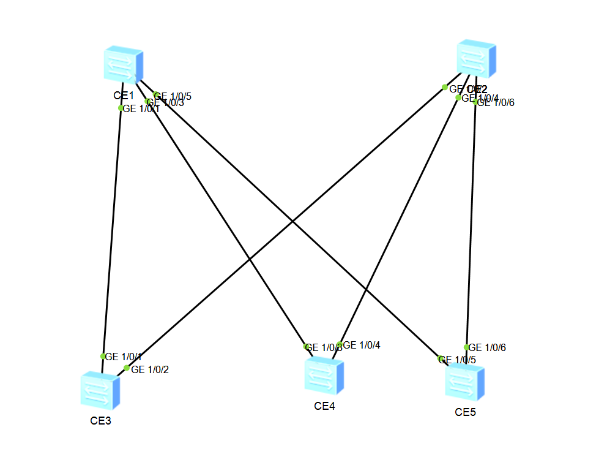

Домашнее задание №1

Underlay. OSPF

Цель:

Настроить OSPF для Underlay сети

Описание:

Настроить OSPF в Underlay сети, для IP связанности между всеми сетевыми устройствами.
Зафиксировать в документации - план работы, адресное пространство, схему сети, конфигурацию устройств
Убедится в наличии IP связанности между устройствами в OSFP домене.


Схема сети:




Последовательная конфигурация коммутаторов:

**LEAF1**

```html
interface GE1/0/1
 undo portswitch
 undo shutdown
 ip address 10.1.0.1 255.255.255.254
 ospf network-type p2p
 ospf enable 100 area 0.0.0.0
#
interface GE1/0/2
 undo portswitch
 undo shutdown
 ip address 10.2.0.1 255.255.255.254
 ospf network-type p2p
 ospf enable 100 area 0.0.0.0
#
interface LoopBack1
 ip address 172.16.0.2 255.255.255.255
 ospf enable 100 area 0.0.0.0
#
interface NULL0
#
ospf 100 router-id 172.16.0.2
 area 0.0.0.0
#
```html

**LEAF2**

```html
interface GE1/0/3
 undo portswitch
 undo shutdown
 ip address 10.1.0.3 255.255.255.254
 ospf network-type p2p
 ospf enable 100 area 0.0.0.0
#
interface GE1/0/4
 undo portswitch
 undo shutdown
 ip address 10.2.0.2 255.255.255.254
 ospf network-type p2p
 ospf enable 100 area 0.0.0.0
#
interface LoopBack1
 ip address 172.16.0.1 255.255.255.255
 ospf enable 100 area 0.0.0.0
#
interface NULL0
#
ospf 100 router-id 172.16.0.1
 area 0.0.0.0
#
```html
