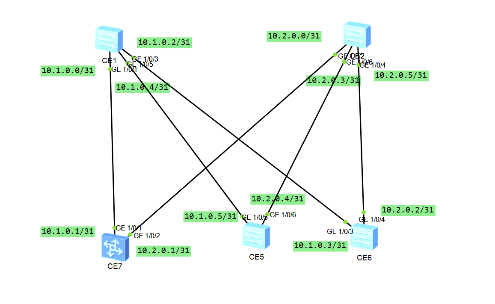

Домашнее задание №3

Underlay. ISIS

Цель:

 - Настроить ISIS для Underlay сети

Описание:

 - Настроить ISIS в Underlay сети, для IP связанности между всеми сетевыми устройствами.
 - Зафиксировать в документации - план работы, адресное пространство, схему сети, конфигурацию устройств
 - Убедится в наличии IP связанности между устройствами в ISIS домене.


Схема сети:


Последовательная конфигурация коммутаторов (всё связанное с OSPF удалено):


**SPINE1**

```html

isis 1
 is-level level-2
 network-entity 49.0000.0000.0011.00
#
interface MEth0/0/0
 undo shutdown
#
interface GE1/0/0
 shutdown
#
interface GE1/0/1
 undo portswitch
 undo shutdown
 ip address 10.1.0.0 255.255.255.254
 isis enable 1
 isis dis-priority 110
#
interface GE1/0/2
 shutdown
#
interface GE1/0/3
 undo portswitch
 undo shutdown
 ip address 10.1.0.2 255.255.255.254
 isis enable 1
 isis dis-priority 100
#
interface GE1/0/4
 shutdown
#
interface GE1/0/5
 undo portswitch
 undo shutdown
 ip address 10.1.0.4 255.255.255.254
 isis enable 1
 isis dis-priority 100
#

```

**SPINE1**

```html

isis 1
 is-level level-2
 network-entity 49.0000.0000.0012.00
#
interface MEth0/0/0
 undo shutdown
#
interface GE1/0/0
 shutdown
#
interface GE1/0/1
 shutdown
#
interface GE1/0/2
 undo portswitch
 undo shutdown
 ip address 10.2.0.0 255.255.255.254
 isis enable 1
 isis circuit-type p2p
#
interface GE1/0/3
 shutdown
#
interface GE1/0/4
 undo portswitch
 undo shutdown
 ip address 10.2.0.3 255.255.255.254
 isis enable 1
 isis circuit-type p2p
#
interface GE1/0/5
 shutdown
#
interface GE1/0/6
 undo portswitch
 undo shutdown
 ip address 10.2.0.5 255.255.255.254
 isis enable 1
 isis circuit-type p2p
#

```

**LEAF1**

```html

isis 1
 is-level level-2
 network-entity 49.0000.0000.0021.00
#
interface MEth0/0/0
 undo shutdown
#
interface GE1/0/0
 undo shutdown
#
interface GE1/0/1
 undo portswitch
 undo shutdown
 ip address 10.1.0.1 255.255.255.254
 isis enable 1
 isis dis-priority 100
#
interface GE1/0/2
 undo portswitch
 undo shutdown
 ip address 10.2.0.1 255.255.255.254
 isis enable 1
 isis circuit-type p2p
#

```

**LEAF2**

```html

isis 1
 is-level level-2
 network-entity 49.0000.0000.0022.00
#
interface MEth0/0/0
 undo shutdown
#
interface GE1/0/0
 shutdown
#
interface GE1/0/1
 shutdown
#
interface GE1/0/2
 shutdown
#
interface GE1/0/3
 undo portswitch
 undo shutdown
 ip address 10.1.0.3 255.255.255.254
 isis enable 1
 isis dis-priority 90
#
interface GE1/0/4
 undo portswitch
 undo shutdown
 ip address 10.2.0.2 255.255.255.254
 isis enable 1
 isis circuit-type p2p
#

```
**LEAF3**

```html

isis 1
 is-level level-2
 network-entity 49.0000.0000.0023.00
#
interface MEth0/0/0
 undo shutdown
#
interface GE1/0/0
 shutdown
#
interface GE1/0/1
 shutdown
#
interface GE1/0/2
 shutdown
#
interface GE1/0/3
 shutdown
#
interface GE1/0/4
 shutdown
#
interface GE1/0/5
 undo portswitch
 undo shutdown
 ip address 10.1.0.5 255.255.255.254
 isis enable 1
#
interface GE1/0/6
 undo portswitch
 undo shutdown
 ip address 10.2.0.4 255.255.255.254
 isis enable 1
 isis circuit-type p2p
#

```

Соседство установлено

```html
<SPINE1>dis isis peer

Peer Information for ISIS(1)
--------------------------------------------------------------------------------

  System ID     Interface       Circuit ID        State HoldTime(s) Type     PRI
--------------------------------------------------------------------------------
0000.0000.0021  GE1/0/1         0000.0000.0011.01  Up            26 L2       100
0000.0000.0022  GE1/0/3         0000.0000.0011.02  Up            27 L2        90
0000.0000.0023  GE1/0/5         0000.0000.0011.03  Up            28 L2        64

Total Peer(s): 3
```

```html
<SPINE2> dis isis peer

Peer Information for ISIS(1)
--------------------------------------------------------------------------------

  System ID     Interface       Circuit ID        State HoldTime(s) Type     PRI
--------------------------------------------------------------------------------
0000.0000.0021  GE1/0/2         0000000007         Up            30 L2        --
0000.0000.0022  GE1/0/4         0000000006         Up            24 L2        --
0000.0000.0023  GE1/0/6         0000000008         Up            24 L2        --

Total Peer(s): 3
```


Статус интерфейсов на SPINE'ах:

```html
<SPINE1>dis isis int

Interface Information for ISIS(1)
--------------------------------------------------------------------------------
 Interface         ID      IPV4 State          IPV6 State      MTU  Type  DIS
 GE1/0/1           001         Up          Mtu:Dn/Lnk:Dn/IP:Dn 1497 L1/L2 No/Yes
 GE1/0/3           002         Up          Mtu:Dn/Lnk:Dn/IP:Dn 1497 L1/L2 No/Yes
 GE1/0/5           003         Up          Mtu:Dn/Lnk:Dn/IP:Dn 1497 L1/L2 No/Yes
```

```html

<SPINE2> dis isis int 

Interface Information for ISIS(1)
--------------------------------------------------------------------------------
 Interface         ID      IPV4 State          IPV6 State      MTU  Type  DIS
 GE1/0/2           005         Up          Mtu:Dn/Lnk:Dn/IP:Dn 1497 L1/L2 --
 GE1/0/4           007         Up          Mtu:Dn/Lnk:Dn/IP:Dn 1497 L1/L2 --
 GE1/0/6           009         Up          Mtu:Dn/Lnk:Dn/IP:Dn 1497 L1/L2 --


```

Тут требуется пояснение того, что было сконфигурированно.
Насколько я понял DIS дожен быть один в домене ISIS. Все коммутаторы - L2, так сделано, чтобы упростить схему и настройку.
На SPINE1 задал приоритет 3 трёх нисходящих интерфейсов выше, чем они стоят по умолчанию(64), чтобы стать DIS, а для остальных коммутаторов установил p2p.

*Проверка доступности*



Прверим несколко маршрутов с помощью ICMP.

```html

[~SPINE1]ping -a 10.1.0.0 10.2.0.2
  PING 10.2.0.2: 56  data bytes, press CTRL_C to break
    Reply from 10.2.0.2: bytes=56 Sequence=1 ttl=255 time=9 ms
    Reply from 10.2.0.2: bytes=56 Sequence=2 ttl=255 time=4 ms
    Reply from 10.2.0.2: bytes=56 Sequence=3 ttl=255 time=3 ms
    Reply from 10.2.0.2: bytes=56 Sequence=4 ttl=255 time=7 ms
    Reply from 10.2.0.2: bytes=56 Sequence=5 ttl=255 time=6 ms

  --- 10.2.0.2 ping statistics ---
    5 packet(s) transmitted
    5 packet(s) received
    0.00% packet loss
    round-trip min/avg/max = 3/5/9 ms

```

```html

<SPINE2>ping -a 10.2.0.3 10.1.0.0
  PING 10.1.0.0: 56  data bytes, press CTRL_C to break
    Reply from 10.1.0.0: bytes=56 Sequence=1 ttl=254 time=14 ms
    Reply from 10.1.0.0: bytes=56 Sequence=2 ttl=254 time=12 ms
    Reply from 10.1.0.0: bytes=56 Sequence=3 ttl=254 time=8 ms
    Reply from 10.1.0.0: bytes=56 Sequence=4 ttl=254 time=12 ms
    Reply from 10.1.0.0: bytes=56 Sequence=5 ttl=254 time=14 ms

  --- 10.1.0.0 ping statistics ---
    5 packet(s) transmitted
    5 packet(s) received
    0.00% packet loss
    round-trip min/avg/max = 8/12/14 ms


```

Настроим BFD.

**SPINE1**

```html

#
bfd
#
isis 1
 is-level level-2
 bfd all-interfaces enable
 network-entity 49.0000.0000.0011.00
#
interface GE1/0/1
 undo portswitch
 undo shutdown
 ip address 10.1.0.0 255.255.255.254
 isis enable 1
 isis cost 5
 isis bfd enable
 isis bfd min-tx-interval 300 min-rx-interval 300 detect-multiplier 5
 isis dis-priority 110
#

[~SPINE1-isis-1]display isis bfd session int ge1/0/1

BFD session information for ISIS(1)
--------------------------------------------------------------------------------
Peer System ID : 0000.0000.0021        Interface : GE1/0/1            
TX : 300           BFD State : up      Peer IP Address : 10.1.0.1
RX : 300           LocDis : 16385      Local IP Address: 10.1.0.0
Multiplier : 5     RemDis : 16385      Type : L2  
Diag : No diagnostic information
Total BFD session(s): 1


```

**LEAF1**

```html
#
bfd
#
isis 1
 is-level level-2
 bfd all-interfaces enable
 network-entity 49.0000.0000.0021.00
#
interface GE1/0/1
 undo portswitch
 undo shutdown
 ip address 10.1.0.1 255.255.255.254
 isis enable 1
 isis cost 5
 isis bfd enable
 isis bfd min-tx-interval 300 min-rx-interval 300 detect-multiplier 5
 isis dis-priority 100
#

[~LEAF1]display isis bfd session int ge1/0/1

BFD session information for ISIS(1)
------------------------------------------------------------------------------
Peer System ID : 0000.0000.0011        Interface : GE1/0/1            
TX : 300           BFD State : up      Peer IP Address : 10.1.0.0
RX : 300           LocDis : 16385      Local IP Address: 10.1.0.1
Multiplier : 5     RemDis : 16385      Type : L2  
Diag : No diagnostic information
Total BFD session(s): 1

```

После выключения соостветсвующего интерфейса на LEAF1, BFD SPINE1 сработал.

```html

<SPINE1>terminal monitor 
Info: Current terminal monitor is on.
<SPINE1>
#47/active/linkDown/Major/occurredTime:2024-11-26 14:05:54/-/-/alarmID:0x0852000
3/CID=0x807a0404:The interface status changes. (ifName=GE1/0/1, AdminStatus=UP, 
OperStatus=DOWN, Reason=Interface physical link is down, mainIfname=GE1/0/1)

Nov 26 2024 14:05:54 SPINE1 %%01IFNET/2/linkDown_active(l):CID=0x807a0404-alarmI
D=0x08520003;The interface status changes. (ifName=GE1/0/1, AdminStatus=UP, Oper
Status=DOWN, Reason=Interface physical link is down, mainIfname=GE1/0/1)

#48/active/isisAdjacencyChange/Major/occurredTime:2024-11-26 14:05:54/-/-/alarmI
D:0x0001009e/CID=0x80890438:ISIS adjacency state change. (SysInstance=1, SysLeve
l=2, CircIndex=1, CircIfIndex=3, LspId=0000.0000.0021.00.00, AdjState=1, IfIndex
=3, IfName=GE1/0/1, Reason=The physical interface went Down, SubReason=The IS-IS
 interface went Down)

Nov 26 2024 14:05:54 SPINE1 %%01ISIS/2/isisAdjacencyChange_active(l):CID=0x80890
438-alarmID=0x0001009e;ISIS adjacency state change. (SysInstance=1, SysLevel=2, 
CircIndex=1, CircIfIndex=3, LspId=0000.0000.0021.00.00, AdjState=1, IfIndex=3, I
fName=GE1/0/1, Reason=The physical interface went Down, SubReason=The IS-IS inte
rface went Down)

Nov 26 2024 14:05:56 SPINE1 %%01BFD/4/STACHG_TODWN(l):CID=0x8074040f;BFD session
 changed to Down. (SlotNumber=1, Discriminator=16385, Diagnostic=DetectDown, App
lications=ISIS, ProcessPST=False, BindInterfaceName=GE1/0/1, InterfacePhysicalSt
ate=Down, InterfaceProtocolState=Down, TunnelName=-)

Nov 26 2024 14:05:56 SPINE1 %%01BFD/4/hwBfdSessDown(l):CID=0x8074040f;Session ch
anges to DOWN. (Index=16385, ConfigurationName=-, PeerIp=10.1.0.1, BindIfIndex=3
, BindIfName=GE1/0/1, Diagnosis=1, BindVrfIndex=0, BindVpnName=_public_, Session
Type=2, DefaultIp=1, BindType=4, StaticLspName=-, PwSecondary=3, NextHop=0.0.0.0
, VcId=0, VsiName=-, VsiPeerAddress=0.0.0.0, DiscrAuto=2, PeerIpv6=::, Ipv6NextH
op=::)

Nov 26 2024 14:05:56 SPINE1 %%01BFD/4/hwBfdSessDown(t):CID=0x8074040f-OID=1.3.6.
1.4.1.2011.5.25.38.3.1;Session changes to DOWN. (Index=16385, ConfigurationName=
-, PeerIp=10.1.0.1, BindIfIndex=3, BindIfName=GE1/0/1, Diagnosis=1, BindVrfIndex
=0, BindVpnName=_public_, SessionType=2, DefaultIp=1, BindType=4, StaticLspName=
-, PwSecondary=3, NextHop=0.0.0.0, VcId=0, VsiName=-, VsiPeerAddress=0.0.0.0, Di
scrAuto=2, PeerIpv6=::, Ipv6NextHop=::)

```

Аутентификация.

У Huawei есть 3 вида аутентификации:

 - на интерфейсе - между двумя интерфейсами, подключёнными непосредственно, можно насторить обмен инфой об аутентификации, инкапслулированной в Hello-пакет.
 - по зоне - настраивается в процессе ISIS для обмена инфой об аутентификаци, иинкапслулированной в Level-1 IS-IS-пакет для Level-1 зоны.
 - по домену - настраивается в процессе ISIS для обмена инфой об аутентификаци, иинкапслулированной в Level-2 IS-IS-паке тдля Level-2 зоны.

Настраиваем по домену.

```html
[~SPINE1-isis-1]di th
#
isis 1
 is-level level-2
 bfd all-interfaces enable
 network-entity 49.0000.0000.0011.00
 domain-authentication-mode md5 cipher %^%#OK|^S}7>|2B/pxP~)@-04-3p@:_LIJ<rkYFL<
0rV%^%# ip
#

```

После настройки процесса аутентификации на SPINE1, на нём же и подключённым LEAF3 пошли ошибки
