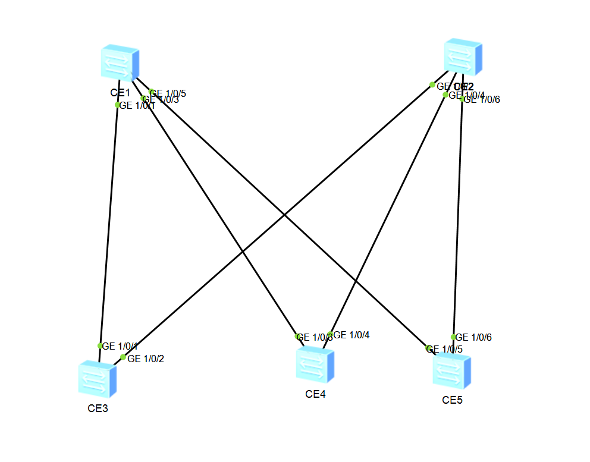

Домашнее задание №3

Underlay. ISIS

Цель:

 - Настроить ISIS для Underlay сети

Описание:

 - Настроить ISIS в Underlay сети, для IP связанности между всеми сетевыми устройствами.
 - Зафиксировать в документации - план работы, адресное пространство, схему сети, конфигурацию устройств
 - Убедится в наличии IP связанности между устройствами в ISIS домене.


Схема сети:




Последовательная конфигурация коммутаторов (всё связанное с OSPF удалено):


**SPINE1**

```html

isis 1
 is-level level-2
 network-entity 49.0000.0000.0011.00
#
interface MEth0/0/0
 undo shutdown
#
interface GE1/0/0
 shutdown
#
interface GE1/0/1
 undo portswitch
 undo shutdown
 ip address 10.1.0.0 255.255.255.254
 isis enable 1
 isis dis-priority 110
#
interface GE1/0/2
 shutdown
#
interface GE1/0/3
 undo portswitch
 undo shutdown
 ip address 10.1.0.2 255.255.255.254
 isis enable 1
 isis dis-priority 100
#
interface GE1/0/4
 shutdown
#
interface GE1/0/5
 undo portswitch
 undo shutdown
 ip address 10.1.0.4 255.255.255.254
 isis enable 1
 isis dis-priority 100
#

```

**SPINE1**

```html

isis 1
 is-level level-2
 network-entity 49.0000.0000.0012.00
#
interface MEth0/0/0
 undo shutdown
#
interface GE1/0/0
 shutdown
#
interface GE1/0/1
 shutdown
#
interface GE1/0/2
 undo portswitch
 undo shutdown
 ip address 10.2.0.0 255.255.255.254
 isis enable 1
 isis circuit-type p2p
#
interface GE1/0/3
 shutdown
#
interface GE1/0/4
 undo portswitch
 undo shutdown
 ip address 10.2.0.3 255.255.255.254
 isis enable 1
 isis circuit-type p2p
#
interface GE1/0/5
 shutdown
#
interface GE1/0/6
 undo portswitch
 undo shutdown
 ip address 10.2.0.5 255.255.255.254
 isis enable 1
 isis circuit-type p2p
#

```

**LEAF1**

```html

isis 1
 is-level level-2
 network-entity 49.0000.0000.0001.00
#
interface MEth0/0/0
 undo shutdown
#
interface GE1/0/0
 undo shutdown
#
interface GE1/0/1
 undo portswitch
 undo shutdown
 ip address 10.1.0.1 255.255.255.254
 isis enable 1
 isis dis-priority 100
#
interface GE1/0/2
 undo portswitch
 undo shutdown
 ip address 10.2.0.1 255.255.255.254
 isis enable 1
 isis circuit-type p2p
#

```

**LEAF2**

```html

isis 1
 is-level level-2
 network-entity 49.0000.0000.0022.00
#
interface MEth0/0/0
 undo shutdown
#
interface GE1/0/0
 shutdown
#
interface GE1/0/1
 shutdown
#
interface GE1/0/2
 shutdown
#
interface GE1/0/3
 undo portswitch
 undo shutdown
 ip address 10.1.0.3 255.255.255.254
 isis enable 1
 isis dis-priority 90
#
interface GE1/0/4
 undo portswitch
 undo shutdown
 ip address 10.2.0.2 255.255.255.254
 isis enable 1
 isis circuit-type p2p
#

```
**LEAF3**

```html

isis 1
 is-level level-2
 network-entity 49.0000.0000.0023.00
#
interface MEth0/0/0
 undo shutdown
#
interface GE1/0/0
 shutdown
#
interface GE1/0/1
 shutdown
#
interface GE1/0/2
 shutdown
#
interface GE1/0/3
 shutdown
#
interface GE1/0/4
 shutdown
#
interface GE1/0/5
 undo portswitch
 undo shutdown
 ip address 10.1.0.5 255.255.255.254
 isis enable 1
#
interface GE1/0/6
 undo portswitch
 undo shutdown
 ip address 10.2.0.4 255.255.255.254
 isis enable 1
 isis circuit-type p2p
#

```

Соседство установлено

```html
<SPINE1>dis isis peer

Peer Information for ISIS(1)
--------------------------------------------------------------------------------

  System ID     Interface       Circuit ID        State HoldTime(s) Type     PRI
--------------------------------------------------------------------------------
0000.0000.0021  GE1/0/1         0000.0000.0011.01  Up            26 L2       100
0000.0000.0022  GE1/0/3         0000.0000.0011.02  Up            27 L2        90
0000.0000.0023  GE1/0/5         0000.0000.0011.03  Up            28 L2        64

Total Peer(s): 3
```

```html
<SPINE2> dis isis peer

Peer Information for ISIS(1)
--------------------------------------------------------------------------------

  System ID     Interface       Circuit ID        State HoldTime(s) Type     PRI
--------------------------------------------------------------------------------
0000.0000.0021  GE1/0/2         0000000007         Up            30 L2        --
0000.0000.0022  GE1/0/4         0000000006         Up            24 L2        --
0000.0000.0023  GE1/0/6         0000000008         Up            24 L2        --

Total Peer(s): 3
```


Статус интерфейсов на SPINE'ах:

```html
<SPINE1>dis isis int

Interface Information for ISIS(1)
--------------------------------------------------------------------------------
 Interface         ID      IPV4 State          IPV6 State      MTU  Type  DIS
 GE1/0/1           001         Up          Mtu:Dn/Lnk:Dn/IP:Dn 1497 L1/L2 No/Yes
 GE1/0/3           002         Up          Mtu:Dn/Lnk:Dn/IP:Dn 1497 L1/L2 No/Yes
 GE1/0/5           003         Up          Mtu:Dn/Lnk:Dn/IP:Dn 1497 L1/L2 No/Yes
```

```html

<SPINE2> dis isis int 

Interface Information for ISIS(1)
--------------------------------------------------------------------------------
 Interface         ID      IPV4 State          IPV6 State      MTU  Type  DIS
 GE1/0/2           005         Up          Mtu:Dn/Lnk:Dn/IP:Dn 1497 L1/L2 --
 GE1/0/4           007         Up          Mtu:Dn/Lnk:Dn/IP:Dn 1497 L1/L2 --
 GE1/0/6           009         Up          Mtu:Dn/Lnk:Dn/IP:Dn 1497 L1/L2 --


```

Тут требуется пояснение того, что было сконфигурированно.
Насколько я понял DIS дожен быть один в домене ISIS. Все коммутаторы - L2, так сделано, чтобы упростить схему и настройку.
На SPINE1 задал приоритет 3 трёх нисходящих интерфейсов выше, чем они стоят по умолчанию(64), чтобы стать DIS, а для остальных коммутаторов установил p2p.

*Проверка доступности*


Прверим несколко маршрутов с помощью ICMP.

```html


```
