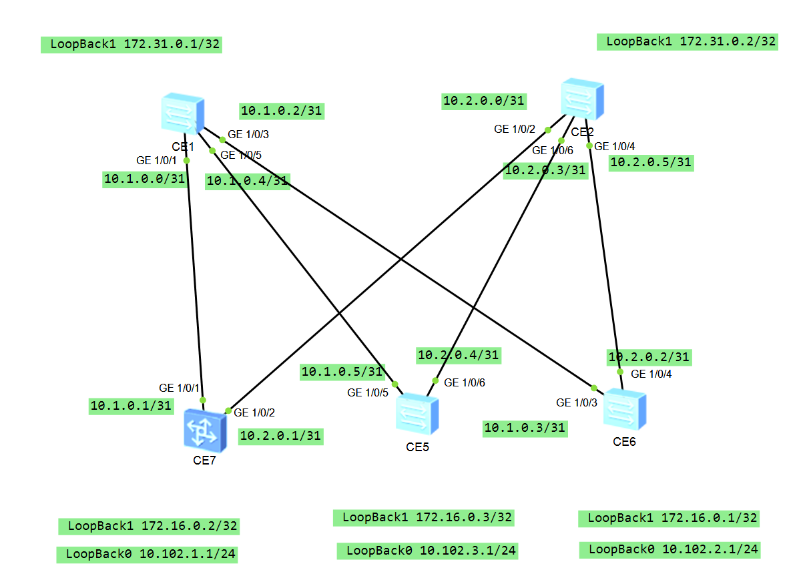

Домашнее задание №4

Underlay. BGP

Цель:

 - Настроить BGP для Underlay сети

Описание:

 - Настроите BGP в Underlay сети, для IP связанности между всеми сетевыми устройствами. iBGP или eBGP.
 - Зафиксируете в документации - план работы, адресное пространство, схему сети, конфигурацию устройст
 - Убедитесь в наличии IP связанности между устройствами в BGP домене

Схема сети:



**iBGP.**

SPINE 1 и 2 будут выступать в роли RR, у которых настроены cluster-id 1 и 2, соответственно.

Последовательная конфигурация коммутаторов:

SPINE1

```html

interface LoopBack0
 ip address 10.100.1.1 255.255.255.0
#
interface LoopBack1
 ip address 172.31.0.1 255.255.255.255
#
bgp 65001
 router-id 172.31.0.1
 peer 10.1.0.1 as-number 65001
 peer 10.1.0.3 as-number 65001
 peer 10.1.0.5 as-number 65001
 #
 ipv4-family unicast
  reflector cluster-id 1
  network 10.1.0.0 255.255.255.254
  network 10.1.0.2 255.255.255.254
  network 10.1.0.4 255.255.255.254
  peer 10.1.0.1 enable
  peer 10.1.0.1 reflect-client
  peer 10.1.0.3 enable
  peer 10.1.0.3 reflect-client
  peer 10.1.0.5 enable
  peer 10.1.0.5 reflect-client
#


```

SPINE2

```html

interface LoopBack0
 ip address 10.100.1.2 255.255.255.0
#
interface LoopBack1
 ip address 172.31.0.2 255.255.255.255
#
bgp 65001
 router-id 172.31.0.2
 peer 10.2.0.1 as-number 65001
 peer 10.2.0.2 as-number 65001
 peer 10.2.0.4 as-number 65001
 #
 ipv4-family unicast
  reflector cluster-id 2
  network 10.2.0.0 255.255.255.254
  network 10.2.0.2 255.255.255.254
  network 10.2.0.4 255.255.255.254
  peer 10.2.0.1 enable
  peer 10.2.0.1 reflect-client
  peer 10.2.0.2 enable
  peer 10.2.0.2 reflect-client
  peer 10.2.0.4 enable
  peer 10.2.0.4 reflect-client
#


```

Как и написанно выше SPINE 1/2 выступают в роли RR, для этого нужно указать номер кластрера и непосредственно клиентов.
На Huawei есть возможность объединить клиентов RR в группу, но у меня не получилось состояния establashed при такой настройке. 

LEAF1

```htlm

interface LoopBack0
 ip address 10.102.1.1 255.255.255.0
#
interface LoopBack1
 ip address 172.16.0.2 255.255.255.255
#
bgp 65001
 router-id 172.16.0.2
 peer 10.1.0.0 as-number 65001
 peer 10.2.0.0 as-number 65001
 #
 ipv4-family unicast
  network 10.1.0.0 255.255.255.254
  network 10.2.0.0 255.255.255.254
  network 10.102.1.0 255.255.255.0
  peer 10.1.0.0 enable
  peer 10.2.0.0 enable
#


```

LEAF2

```htlm

interface LoopBack0
 ip address 10.102.2.1 255.255.255.0
#
interface LoopBack1
 ip address 172.16.0.1 255.255.255.255
#
bgp 65001
 router-id 172.16.0.1
 peer 10.1.0.2 as-number 65001
 peer 10.2.0.3 as-number 65001
 #
 ipv4-family unicast
  network 10.1.0.2 255.255.255.254
  network 10.2.0.2 255.255.255.254
  network 10.102.2.0 255.255.255.0
  peer 10.1.0.2 enable
  peer 10.2.0.3 enable
#


```

LEAF3

```htlm

interface LoopBack0
 ip address 10.102.3.1 255.255.255.0
#
interface LoopBack1
 ip address 172.16.0.3 255.255.255.255
#
bgp 65001
 router-id 172.16.0.3
 peer 10.1.0.4 as-number 65001
 peer 10.2.0.5 as-number 65001
 #
 ipv4-family unicast
  network 10.0.0.4 255.255.255.254
  network 10.1.0.4 255.255.255.254
  network 10.102.3.0 255.255.255.0
  peer 10.1.0.4 enable
  peer 10.2.0.5 enable
#


```


Для LEAF'ов указал RR, а также сделал Loopback'и с номером 0, чтобы их анонсировать друг други, а затем проверить их доступность.

*Аутентификация*

Довольно простая:

```html
bgp 65001
 router-id 172.16.0.2
 peer 10.1.0.0 as-number 65001
 peer 10.1.0.0 password cipher %^%#xKg$;"G8_3csXR9Y76EKK8OyIM22wJ^3I(8++awQ%^%#

bgp 65001
 router-id 172.31.0.1
 peer 10.1.0.1 as-number 65001
 peer 10.1.0.1 password cipher %^%#Z[WX,tlRuHl{^y~lg::3w'_Z8'E6vRHAhZ3JkK'(%^%#


<LEAF1>dis bgp peer 10.1.0.0 ver
 Address family IPv4 Unicast: advertised and received
 Received:
                  Total  messages                1236
                  Update messages                7
                  Open messages                  1
                  KeepAlive messages             1228
                  Notification messages          0
                  Refresh messages               0
 Sent    :
                  Total  messages                1245
                  Update messages                4
                  Open messages                  12
                  KeepAlive messages             1229
                  Notification messages          0
                  Refresh messages               0
 Authentication type configured: MD5
  Last keepalive received: 2024-12-09 15:15:22+00:00
  Last keepalive sent    : 2024-12-09 15:14:48+00:00
  Last update received   : 2024-12-09 14:05:52+00:00
  Last update sent       : 2024-12-09 14:05:00+00:00


<SPINE1>dis bgp peer 10.1.0.1 verbose 
Address family IPv4 Unicast: advertised and received
 Received: 
                  Total  messages                1247
                  Update messages                4
                  Open messages                  1
                  KeepAlive messages             1242
                  Notification messages          0
                  Refresh messages               0
 Sent    : 
                  Total  messages                1254
                  Update messages                7
                  Open messages                  6
                  KeepAlive messages             1241
                  Notification messages          0
                  Refresh messages               0
 Authentication type configured: MD5
  Last keepalive received: 2024-12-09 15:25:59+00:00
  Last keepalive sent    : 2024-12-09 15:26:29+00:00
  Last update received   : 2024-12-09 14:05:00+00:00
  Last update sent       : 2024-12-09 14:05:52+00:00


```


*ПРОВЕРКА*

Пингуем Loopback0 (10.102.1.1) на LEAF1 от LEAF3

```html

<LEAF3>ping -i lo0 10.102.1.1
  PING 10.102.1.1: 56  data bytes, press CTRL_C to break
    Reply from 10.102.1.1: bytes=56 Sequence=1 ttl=254 time=8 ms
    Reply from 10.102.1.1: bytes=56 Sequence=2 ttl=254 time=11 ms
    Reply from 10.102.1.1: bytes=56 Sequence=3 ttl=254 time=10 ms
    Reply from 10.102.1.1: bytes=56 Sequence=4 ttl=254 time=6 ms
    Reply from 10.102.1.1: bytes=56 Sequence=5 ttl=254 time=5 ms

  --- 10.102.1.1 ping statistics ---
    5 packet(s) transmitted
    5 packet(s) received
    0.00% packet loss
    round-trip min/avg/max = 5/8/11 ms

<LEAF3>ping -a 10.102.3.1 10.102.1.1
  PING 10.102.1.1: 56  data bytes, press CTRL_C to break
    Reply from 10.102.1.1: bytes=56 Sequence=1 ttl=254 time=9 ms
    Reply from 10.102.1.1: bytes=56 Sequence=2 ttl=254 time=9 ms
    Reply from 10.102.1.1: bytes=56 Sequence=3 ttl=254 time=10 ms
    Reply from 10.102.1.1: bytes=56 Sequence=4 ttl=254 time=7 ms
    Reply from 10.102.1.1: bytes=56 Sequence=5 ttl=254 time=7 ms

  --- 10.102.1.1 ping statistics ---
    5 packet(s) transmitted
    5 packet(s) received
    0.00% packet loss
    round-trip min/avg/max = 7/8/10 ms


```
